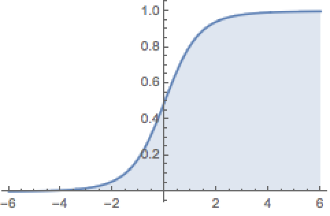
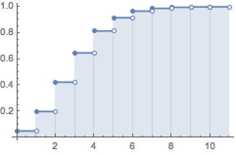

# 统计模型
这篇我们讨论统计模型，那么到底什么是统计模型？统计模型是一系列对事实进行简化的分布，这些分布需要参数（parameter）做微调。

为什么我们需要简化事实？以地图为例，如果地图越来越精细、越来越大，以至于它可以 1:1 地刻画现实世界，这张地图还有用吗？我们需要简化事实的模型帮助我们[从复杂的数据里得到有用的信息](http://blog.extensionengine.com/drowning-in-data-the-biggest-hurdle-for-mooc-proliferation/)，所谓[数据越多模型越不重要](https://scensci.wordpress.com/2012/12/14/big-data-or-pig-data/)的说法非常可笑，而许多媒体（例如连线）还深深相信这是事实。

正如 George Box 所言，所有模型都是错的，但有些模型有用。

> All models are wrong, but some models are useful.  

## 参数模型与非参数模型
什么是参数？假如有一个函数 f(x) = ax + b，a、b 不是自变量，我们需要给定 a、b 的值才能计算函数 f(x)，这里的 a、b 就是参数。在统计中，f(x) = ax + b 是我们选择的模型，a、b 参数通常是未知的，需要用样本分布的参数（estimator）估计（estimate）人口分布的参数（estimand）。

我们把统计模型分为两类，参数模型与非参数模型。参数模型（例如正态分布、二项分布）需要有限个的参数（例如均值、方差），非参数模型（例如 Bootstrap）需要无限个参数。这个分法不完全绝对，像半参数模型是把无限个的参数和有限个的参数分离来研究。

常理说参数越多、假设越少、适用范围更广，但记住「没有免费的午餐（No Free Lunch）」！这个定理告诉我们，不存在万能的模型（就像深度学习不一定可以解决一切机器学习的问题），具体情况需要具体分析，在使用统计模型前，一定要对数据进行探索性数据分析再套模型，如果效果不佳，再继续尝试，数据科学是不断往复尝试（iterative）的过程。

## 概率密度函数与累积分布函数
我们使用概率密度函数（Probability Density Function, PDF）与累积分布函数（Cumulative Distribution Function, CDF）来描述连续型变量（continuous random variable）的概率分布，对于离散型变量（discrete random variable）的分布，使用的是概率质量函数（Probability Mass Function, PMF）与累积分布函数（Cumulative Distribution Function, CDF）来描述。

人口的身高可以看做是连续型变量，PDF 描述了身高在 (m, n) 区间的「可能性」，PDF 在 (m, n) 区间的面积（也就是积分）对应的就是身高在 (m, n) 区间的概率。但是，只取一点 m 不能得到身高 = m 的概率（积分为0），你应该取一个极小值 ε， (m-ε, m+ε) 区间的积分，才是身高 = m 的概率。

而对于离散型变量，例如医院每天新生儿数目，你取 x = 5，就能在 PMF 上得到诞生 5 名新生儿的概率，这是 PDF 与 PMF 最大的区别。

CDF 描述了 PDF、PMF 所覆盖的面积。在人口身高 CDF 上取 x = n，你得到的值是身高在 (0, n) 区间的概率（身高不可能是负数吧），如果你想知道身高在 (m, n) 区间的概率，你应该在人口身高 CDF 上取 x = n 和 x = m，对应的 f(n) - f(m)，就是身高在 (m, n) 区间的概率。

## 二项分布
在说二项分布前，有必要说明什么是伯努利分布。伯努利分布描述的是单次、有两种结果（成功和失败）的随机事件的概率，例如抛一次硬币就是伯努利分布，因为结果可能是正面或者背面。二项分布则描述了多次（$n$ 次）伯努利分布的概率分布, 假设 $p$ 是结果为正面的概率，$P(K = k)$ 表示抛 $n$ 次硬币有 $k$ 次为正面的概率。

$$P(K = k) = \frac {n!} {(n-k)! × k!} \times p^{k}(1-p)^{n-k}$$

由于期望值和方差是线性（linearity）的，因此可以用伯努利分布的 $n$ 次叠加推导出二项分布的期望值和方差。

$$E(X+Y)=E(X)+E(Y)\\
E(K)=p+p+...p+p=np$$

$$Var(X+Y)=Var(X)+Var(Y)\\
Var(K)=p(1-p)+p(1-p)+...p(1-p)+p(1-p)=np(1-p)$$

## 泊松分布
二项分布里事件发生的次数足够多、成功的概率很小时，就是泊松分布。医院平均每日新生儿数目为 $\lambda$，每日出生 $k$ 名新生儿的概率为多少呢？我们可以把一天里的时间分成 $n$ 份事件（比如每秒为一份），每份事件有两种结果（有新生儿和没有新生儿），$n$ 足够大，每一份时间出生新生儿的概率 $\frac{\lambda}{n}$ 足够小，我们就能引入自然常数 e，经过推导可得：

$$P(K=k) = \frac{\lambda^{k}e^{-\lambda}}{k!}$$

泊松分布成立的条件是 n 足够大（事件次数足够多），$\lambda/n$（每次事件发生的概率）足够小。例如每天车祸发生次数，路上有很多的车，但每辆车发生车祸的概率又很小，这时候就适用于泊松分布。

## 指数分布
指数分布的概率密度函数为 $f(x) = \lambda e ^ {-\lambda x},\ x > 0$，累积分布函数为 $F(x) = 1 - e ^ {-\lambda x}$，PDF 和 CDF 曲线如下。

指数分布是唯一具有无记忆性（memoryless property）的分布。

什么是无记忆性呢？一个例子是彩龄（买彩票的时间）和中彩票，中彩票的概率和你买彩票多少年无关，有人第一次买彩票就中奖，有人一辈子都中不了奖，中彩票的概率对应彩龄的分布就是指数分布。

设 t 为彩龄，累积分布函数为 $F(t) = 1 - e ^ {-\lambda t}$，甲是彩龄 a 年的老彩民，每天都买彩票，甲在 b 年后中彩的概率为 $P(t > a + b\ |\ t > a)$，乙是刚入门的新手，也每天买彩票，乙在 b 年后中彩的概率为 $P(t > b)$，如果甲中彩的概率等于乙中彩的概率，$P(t > a + b\ |\ t > a) = P(t > b)$，则无记忆性成立。

$Proof:$
$$
\begin{split}
P(t > a + b\ |\ t > a) &= \frac {P(t > a + b,\ t > a)}{P(t > a)}，由条件概率公式可得\\
&=\frac {P(t > a + b \bigcap t > a)}{P(t > a)}\\
&=\frac {P(t > a + b)}{P(t > a)}，显然交集是 a+b 年后中彩的概率\\
&=\frac {e^{-\lambda(a+b)}}{e^{-\lambda a}}\\
&=e^{-\lambda b}\\
&=P(t > b)\\
\end{split}
$$

以上证明了指数分布的无记忆性成立。知乎上有人[指出](https://www.zhihu.com/question/36965252)指数分布的无记忆性来源于泊松过程。

由指数分布进行扩展，可以得到韦伯分布（The Weibull Distribution）。

## 正态（高斯）分布
中心极限定理

## Bootstrap
大数定理

## 深入阅读
[Statistical Models](https://book.douban.com/subject/4218659/)
[Statistical Models](https://book.douban.com/subject/4057698/)
