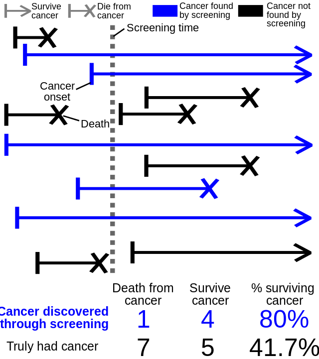
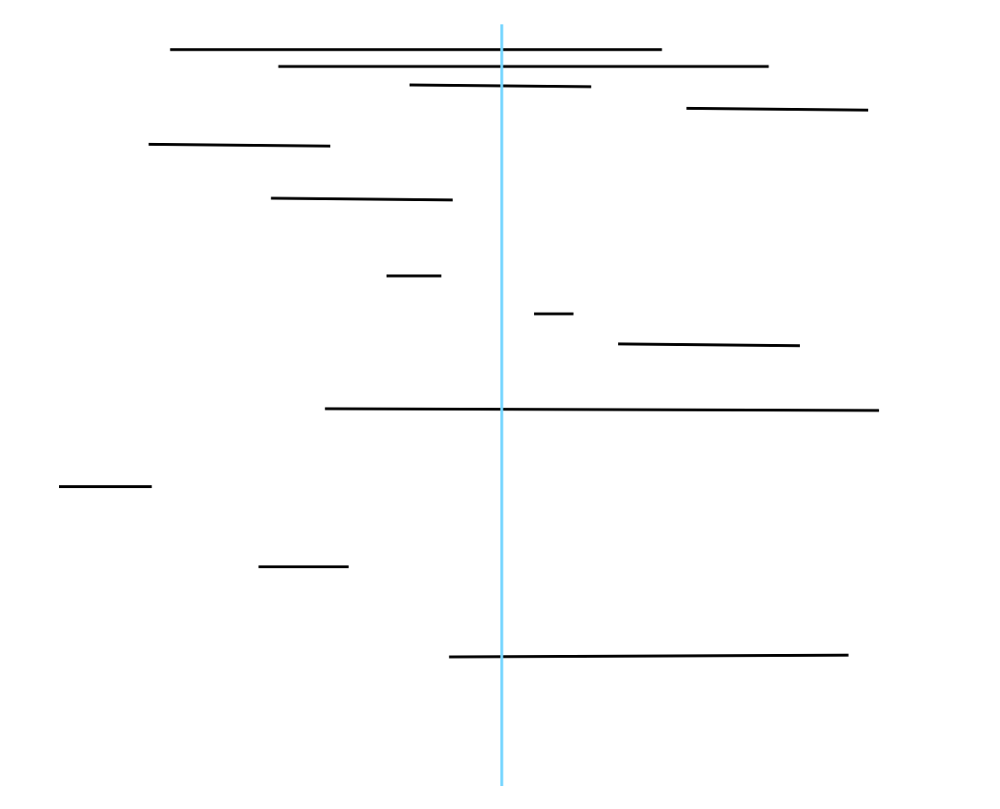
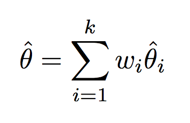
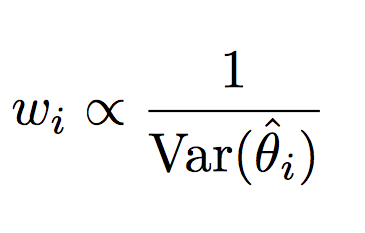
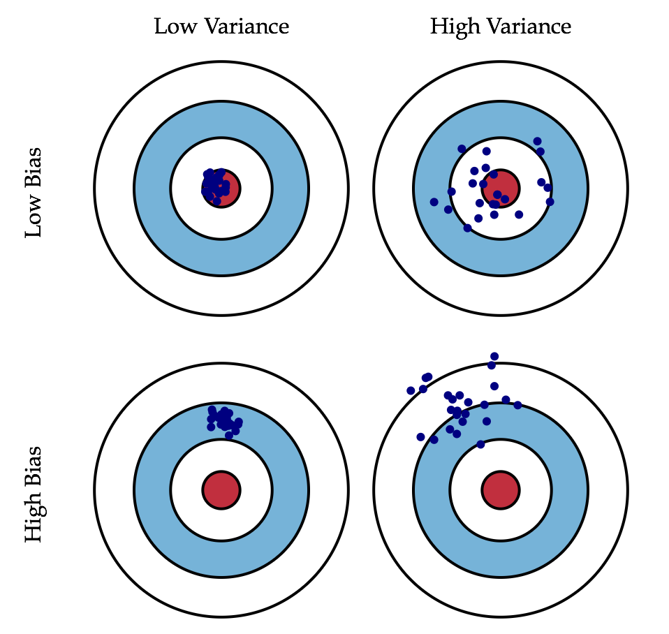
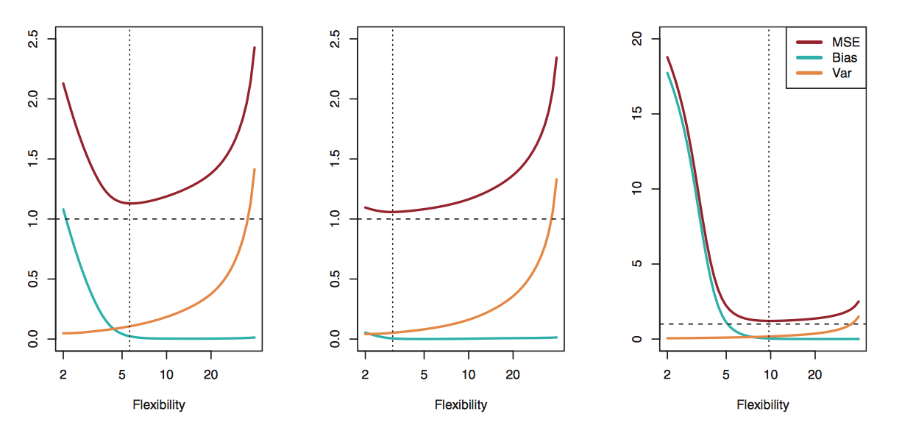

# 偏差与方差
这篇笔记讲模型和真实世界的误差（error）。笔记会先介绍常见的统计偏差（bias），以及如何减少偏差，最后用直觉和数学的方式说明为什么存在偏差（bias）和方差（variance）的取舍。

## 常见偏差
### 选择性偏差（selection bias）
选择性偏差可能是最重要的偏差了，它关于一个基本问题：数据到底是怎么来的？有哪些数据是没有的？

做数据分析时，我们不可能有所有数据，数据只能从总体（population）里抽样，但如果不是随机取样，样本是不能反映总体的，这就产生了选择性偏差。比如[人生规划的选择性偏差](https://zhuanlan.zhihu.com/p/28858045)，你听到的很多道理都来自「成功人士」，但「成功人士」的道理只来源于他们自己的经历，这些道理真的是最佳路径吗？可能还有更多「失败人士」和「成功人士」用同样的方法，但因为失败了而没有被我们看到罢了。

选择性偏差和其他偏差有重叠，以下的一些偏差可以看作选择性偏差的一种。

### 发表性偏差（publication bias）
发表性偏差（publication bias），也叫文件抽屉偏差（file drawer problem），指很多文章被放在抽屉里没有出版，但这些文章其实和出版的文章一样重要。许多科学论文因为没有达到显著的 p 值（0.05）而没有出版，但这些论文其实和达到显著 p 值（0.05）的论文一样重要，凭什么 0.05 就能代表论文的重要程度呢？关于创业成功的书籍很多，创业失败的书籍很少，但这两种书籍都揭示了重要的道理。

### 时距偏差（length time bias）
时距偏差（length bias）指因为观察对象的死亡或者消失，在某一时刻的观察结果不能反应总体情况。

例如调查癌症的死亡率，如图所示，虚线指调查时间，因为许多癌症患者已经死亡了，这时候的调查结果只会显示癌症的死亡率比实际结果低。

另一个例子是调查监狱里囚犯的服刑时长，如果你去监狱里调查囚犯的服刑时长，然后得出 [10% 的美国囚犯需终生服刑](http://www.nytimes.com/2012/02/26/health/dealing-with-dementia-among-aging-criminals.html?pagewanted=all)这样的结论，那么你就犯了时距偏差，因为你在监狱调查的时候，服刑时间短的犯人更不容易被观察到，如图所示，线的长度表示各个犯人的服刑时间，蓝线表示调查时刻，可以看到，只有服刑时间长的犯人更容易被调查到。

### 反应偏差（non-response bias）
2016 年的总统大选民调可能是反应偏差（non-response bias）的最佳例子了，民调显示希拉里大幅领先，但为什么是川普获胜呢？因为民调不能反映拒绝调查的「沉默者」的意见。调查只能得到回应者的态度，但如果拒绝回应的人与回应者的态度不同，那么调查结果就会有反应偏差。

### 幸存者偏差（survivorship bias）
研究对象如果是经过「筛选」的，不考虑筛选过程而直接判断，容易导致幸存者偏差（survivorship bias）。最有名的例子就是二战飞机弹孔问题了，一批战斗机从战场返航，如何从弹孔分布判断加固部位？换言之，是加固弹孔多的地方还是加固弹孔少的地方？答案是加固弹孔少的位置，因为击中致命伤的飞机根本无法返航，返航的飞机恰恰没有被击中要害（也就是弹孔少的地方），更详细的幸存者偏差讨论可以参考[知乎](https://www.zhihu.com/question/21949175/answer/19938682)。

以上是一些常见偏差，更多的偏差类型可以参考维基百科上的 [認知偏誤列表](https://zh.wikipedia.org/wiki/%E8%AA%8D%E7%9F%A5%E5%81%8F%E8%AA%A4%E5%88%97%E8%A1%A8)。

## 如何减少偏差
我们有许多方法来降低偏差，一个是使用权重，给不同来源的数据乘一个权重，可信度高的权重高，可信度低的权重低。

Nate Silver 在 [How The FiveThirtyEight Senate Forecast Model Works](https://fivethirtyeight.com/features/how-the-fivethirtyeight-senate-forecast-model-works/) 指出了其通过历史民调数据来判断不同来源的民调可信度，为这些来源施加不同的权重；统计学家费雪提出了 Fisher Weighting，指出权重应该与数据方差成反比。

另一个方法是多次实验并验证假设（Multiple Hypothesis Testing），但需要使用[邦费罗尼校正](https://zh.wikipedia.org/wiki/邦费罗尼校正?oldformat=true)（Bonferroni correction）决定 p 值：如果你做 100 次实验，总有一次 p 值是低于显著值（比如 0.05）的，邦费罗尼校正要求我们把显著值除以实验次数（也就是把 0.05 ÷ 100 = 0.0005）作为新的显著值。

## 偏差和方差的取舍（the Bias-Variance Tradeoff）
为什么我们不直接把模型的偏差减掉呢？一个原因是我们根本不知道偏差的具体数值，另一个原因是降低偏差可能带来方差的升高，也就是存在偏差和方差的取舍。

Gareth J. et al. 在大名鼎鼎的 [Introduction to Statistical Thinking](https://lagunita.stanford.edu/courses/HumanitiesSciences/StatLearning/Winter2016/info) 里指出，误差（Error）可以分成三个部分：偏差（Bias）、方差（Variance）、不可避免的误差（也叫噪音，Irreducible Error）。下图中，[Scott Fortmann-Roe](http://scott.fortmann-roe.com/docs/BiasVariance.html) 用图像解释了偏差和方差的区别，简而言之，偏差指与真实世界的偏离，方差指接受不同数据后的模型输出的稳定程度。

我们这样直觉（intuitively）地解释偏差和方差的取舍，如果我们选了简单的模型（参数少），给这个模型不同的样本，就算不同的样本有偏差，模型输出的结果都差不多，方差小，而因为模型简单，不能完全反映真实世界，偏差大；如果我们选了复杂的模型（参数多），因为模型复杂，更能反映真实世界，偏差小，但给这个模型不同的样本，不同的样本哪怕有微小的差别，因为参数多，导致输出的结果差别很大，也就是方差大。因此，当模型逐渐从简单到复杂，偏差不断地减小，而方差不断地增大，MSE 呈一条 U 形曲线，如下图所示，好的模型就是误差最低（虚线对应）的点。

数学上，我们可以证明 MSE = Bias + Variance + Irreducible Error，由于 GitHub 不支持 MathJax，具体的证明我放在[知乎专栏](https://zhuanlan.zhihu.com/p/29048531)上。

理想情况下，我们可以让 bias 和 variance 等于 0 的，但我们已经说过模型是对真实世界的简化，我们也不可能获得总体（population）的所有数据，因此误差是必然存在的。当误差已经足够低时，偏差降低会带来方差升高，方差降低则带来偏差升高。

## 深入阅读
现有的大部分资料都把证明一笔带过，我有考据癖，就花了好几个小时查阅和写证明，因为只有严格的数学证明才能摸清定理的假设和边界。我尽可能地让证明足够直白和繁琐以确保基础水平的读者（我就是基础水平）能看懂。但是，这篇笔记仍然存在统计学和机器学习的缝隙，像是 variance，虽然数学式子都一样，但在传统统计学和在机器学习领域的解释不太一样，传统统计学解释 variance 侧重于数据整体分布（spread），机器学习解释 variance 侧重于训练结果（realisation of models），如果你从来没接触过机器学习（或者了解得很少），请查阅以下内容以加强理解：

[Understanding the Bias-Variance Tradeoff](http://scott.fortmann-roe.com/docs/BiasVariance.html)  
[带你读机器学习经典: An Introduction to Statistical Learning (Chapter 1&2)](https://zhuanlan.zhihu.com/p/27556007)  
[机器学习中的Bias(偏差)，Error(误差)，和Variance(方差)有什么区别和联系？](https://www.zhihu.com/question/27068705)  
[Statistical Learning Course](https://lagunita.stanford.edu/courses/HumanitiesSciences/StatLearning/Winter2016/info)  

## 致谢

数据科学导论笔记基于加州大学伯克利校区 [DS100](http://www.ds100.org/sp17/syllabus) 与哈佛大学 [CS109](http://cs109.github.io/2015/pages/videos.html) 的课程主页改写，参考了课件、笔记、阅读材料及作业，感谢制作这两门课程的 Joe Blitzstein、Hanspeter Pfister、Verena Kaynig-Fittkau、Joseph E. Gonzalez、Joseph Hellerstein、Deborah Nolan 和 Bin Yu。本文基于 CS 109 的 Lecture 7: Bias and Regression，还参考了「深入阅读」部分里的文章，感谢作者 @阿萨姆 和 Scott Fortmann-Roe。
